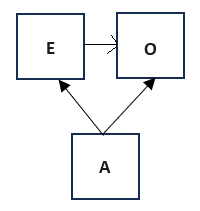

This document demonstrates how to use various R packages, such as `epitools` and `vcm` to identify confounding and interaction effects in epidemiological studies. We are going to follow the hypothetical example presented in Howards, P. P. (2018). An overview of confounding. Part 1: The concept and how to address it. *Acta Obstetricia et Gynecologica Scandinavica*, 97(4), 394–399. https://doi.org/10.1111/aogs.13295. Suppose we are interested in the effect of using *magnesium supplements* (E) on *preterm birth* (O). Further supposed that among pregnant women, older mothers (C = covariate) are more likely to take supplements than younger mothers, and that older maternal age is associated with increased risk of preterm birth (**Note** the paper refers us to Figure 1a in the "companion paper" paper however I do not see such a figure). It probably looks like this:



The data are provided in the table below:

|   |   |   |   |   |   |   |
|:---|:---:|:---:|:---:|:---:|:---:|:---:|
||Total Population|   |Older Mothers|   |Younger Mothers|   |
||Magnesium|No Magnesium|Magnesium|No Magnesium|Magnesium|No Magnesium|
|Preterm|160|630|80|90|80|540|
|Term|4840|4370|920|410|3,920|3,960|
|Total|5,000|5,000|1,000|500|4,000|4,500|
|Risk|0.0320|0.1260|0.0800|0.1800|0.0200|0.1200|
|RD|-0.0940|0.0000|-0.1000|0.0000|-0.1000|0.0000|

: Table 1.1: Data from the idea study design; disaggregated by age

**Make sure you install the packages required to run this lab**

```{r eval=TRUE}
library(epitools) 
library(gmodels) 
library(effects)#Graphical and tabular effect displays, e.g., of interactions, for various statistical models with linear predictors. 
library(car) #note this package comes with base R, so you don't need to install it
library(vcdExtra)
library(vcd)
library("vembedr")
library(tidyverse)
library(sjPlot)
options(scipen=999) #disables scientific notation
```

# Overview
- `epitools` is an R package that allows you to perform basic epidemiologic calculations such as the risk ratio (RR) and odds ratio (OR).
- `effects` is an R package that allows you to make graphical and tabular effect displays of interactions, for various statistical models with linear predictors
- `gmodels` is an R package that allows you to display quantities of interest (e.g., odds ratios) in contingency tables

In this example, we will go over how to use these tools to estimate the risk ratio and odds ratios using the contingency tables reproduced in Howards, et al. (2018). 

## Preliminaries

In the example, magnesium (or not) is the exposure (E) and preterm birth (or term) is the outcome (O).  

In this example, the risk difference (RD) comparing magnesium supplementation to no supplementation is the same for older and younger mothers, but the RD for the total population is biased because a higher proportion of women taking magnesium are older (20%) compared with the women not using supplements (10%).

Notice the typo in the text, 10% and 20% are percentages, not propotions. In any event, this calculation was made as follows:
- The proportion of older women taking magnesium is calculated as 1000/5000 = .20
- The proportion of older women NOT taking magnesium is calculated as 500/5000 = .10

Note, it is important to have the table in the correct format. By default, the unexposed group (exposure = 0; here 'no magnesium') is in the first row, and the non-outcome (outcome = 0; here 'term') is in the first column. That means we would have this arrangement of the data. However, you can use the `epitools` library to change this arrangement with the rev() argument so that the analysis will use the contingency table where the exposed group (exposure = 1) is in the first row and the outcome (outcome = 1) is in the first column.

|   |   |   |
|---|---|---|
||**Term**|**Preterm**|
|**No mag**|4370|630|
|**Mag**|4840|160|

## Step 1

Load the data tables from the appendix in the format it appears in Table 1.1

```{r eval=T}
# Step 1: Create a matrix
(total <- matrix(c(4370, 4840, 630, 160), nrow = 2, ncol = 2))
(older <- matrix(c(410, 920, 90, 80), nrow = 2, ncol = 2))
(younger <- matrix(c(3960, 3920, 540, 80), nrow = 2, ncol = 2))

```
The risk and RD estimates for the population are as follows:
```{r}
(Risk = 160/(160+4840))
(RD = Risk - 660/(660 + 4340))
```

```{r}
all_risk <- riskratio.wald(total, rev = c("neither"))
all_risk

```
The risk ratio is .254 with a 95% confidence interval (.214, .301) which is significant at the $p < .001$ level. Therefore, women in the exposure group 2, (i.e., who took magnesium), had a 74.6% lower risk $(1 - .254) \times 100$ of preterm birth compared to women who did not take magnesium.
```{r}
print(paste("Percent change in the risk:", 1 - unlist(all_risk$measure)[2], sep = " "))
```
```{r}
oddsratio.wald(total, rev = c("neither"))
```

The odds ratio is 0.229 with a 95% CI of 0.192, 0.274. The p-value is <0.001. Therefore women who took magnesium had a 78% lower odds of a preterm birth compared to women who did not take magnesium.

Given that you have taken Biostatistics I and II, you should be able to calculate the risk ratio, risk difference (RD), and odds ratio by hand. Here is how to do that in R:

```{r}
### RR check
risk2 <- 160 / (160+4840)
risk1 <- 630/(630+4370)
(RR <- risk2/risk1)
(RD = risk2 - risk1)
(OR = (4370*160)/(4840*630))
```
```{r}
### OR check
num <- 4370 * 160
denom <- 4840 * 630
OR <- num / denom
OR
```
## Confounding
Let’s suppose we are interested in  whether maternal age is a confounder on the magnesium to birth outcome pathway in the figure.


**Note:** The figure is commonly referred to as a DAG, or a directed acyclic graph. A good introduction to DAGs can be accessed here:

```{r eval = TRUE,echo=FALSE }
embed_url("https://youtu.be/PiekvYYHeVQ?list=PLliBbGBc5nn2QcZ-5K_S08wJR6kt2EK1R")
```

As the figure at the top of this document shows, the confounding variable is associated with the outcome and also with the 'treatment.' The confounding variable is not on the causal pathway between the exposure and outcome. For the first criterion, we look at the association between magnesium uptake and birth outcome.

To check if there is confounding, we need to determine if the confounder meets three criteria:
1. The confounding variable is associated with the outcome
1. The confounding variable is associated with treatment assignment
1. The confounding variable is not on the causal pathway between the exposure and outcome

#### Preliminaries: Wrangling the data for proper format
```{r}
freq_tbl <- tribble(
  ~A, ~E, ~O, ~count,
  "older", "mag", "preterm", 80,
   "older","mag", "term",  920,
   "older","Nomag",  "preterm", 90,
   "older","Nomag",  "term",  410,
   "younger", "mag", "preterm", 80,
   "younger","mag", "term",  3920,
   "younger","Nomag",  "preterm", 540,
   "younger","Nomag",  "term",  3960
) %>% 
  print() %>%
  as.data.frame()
```

#### 1. Is age associated with birth outcomes? (i.e., is the counfounder associated with the outcome?)

This amounts to asking whether younger women had lower risk/odds of preterm birth compared to older women.
To test this hypothesis, I need a 2x2 table with age of women on the row and birth outcome as column
We can use the `margin.table()` to collapse any table over an 'omitted' dimension, like this:


```{r}
(table_obj <- xtabs(count ~ E  + O + A, data=freq_tbl))
age_outcome <- margin.table(table_obj,c(3,2))
(age_outcome_tbl<- matrix(c(620,  170 , 7880, 1330), nrow = 2, ncol= 2))
```
```{r}
riskratio.wald(age_outcome_tbl, rev = c("neither")) #I already formatted it so exposure = 1 and outcome = 1 is in the first cell
```


```{r}
oddsratio.wald(age_outcome_tbl, rev = c("neither"))
```
Younger women had a lower risk (RR = 0.671; 95% CI: 0..582, 0.774) and odds (OR = 0.616; 95% CI: 0.514, 0.736 ) of preterm birth compared to older women. This result is significant.This result is significant.
The first criterion is satisfied.


#### 2. Is age associated with magnesium uptake? (i.e., is the counfounder associated with the exposure?)
This amounts to asking whether younger women had lower risk/odds of magnesium uptake compared to older women?

```{r}
(age_exposure <- margin.table(table_obj,c(3,1)))
(age_exposure_tbl<- matrix(c(4000, 4500, 1000, 500), nrow = 2, ncol= 2))
```
```{r}
riskratio.wald(age_exposure_tbl, rev = c("neither"))
```
```{r}
oddsratio.wald(age_exposure_tbl, rev = c("neither"))
```
Younger women had a lower risk (RR = 0.671; 95% CI: 0..582, 0.774) and odds (OR = 0.616; 95% CI: 0.514, 0.736 ) of magnesium uptake compared to older women. This result is significant. The second criterion is satisfied.

#### 3. Age is not on the causal pathway between exposure and outcome?  
This is satisfied here.

## Stratification
We can check to see how much of an impact age has on the exposure to birth outcome using stratification. We do this by stratifying the groups into those who are younger and older. Then we evaluate the exposure to outcome relationship.

Here is an illustration of how age is stratified into two strata (age = older mothers v younger mothers).

The association between magnesium status and age can be estimated for each strata.
Table3 <- matrix(c(150, 50, 1600, 800), nrow = 2, ncol = 2)

```{r}
older
```

```{r}
older_risk <- riskratio.wald(older, rev = c("both"))
```

```{r}
print(paste("The risk is", 1 - unlist(older_risk$measure)[2], sep = " "))
```

```{r}
oddsratio.wald(older, rev = c("both"))
```

```{r}
### RR check
risk1 <- 80 / (80+920)
risk2 <- 90/(90+410)
(RR <- risk2/risk1)
(RD = risk2 - risk1)
```


```{r}
younger
```


```{r}
younger_risk <- riskratio.wald(younger, rev = c("both"))
```


```{r}
oddsratio.wald(younger, rev = c("both"))
```
```{r}
print(paste("The risk is", 1 - unlist(younger_risk$measure)[2], sep = " "))
```
```{r}
### RR check
risk1 <- 80 / (80+3920)
risk2 <- 540/(540+3960)
(RR <- risk2/risk1)
(RD = risk2 - risk1)
```
```{r}
df <- tibble(
  mag = c(rep("mag", 5000), rep("nomag", 5000)),
  birth = c(rep("preterm", 160), rep("term", 4840 ), rep("preterm", 630), rep("term", 4370))
) %>% 
print()
```
```{r}
table(df)
```
```{r}
# Basic example
df %>% 
  count(mag, birth)
```
```{r}
freq_tbl <- tribble(
  ~E, ~O, ~count,
  "mag", "preterm", 160,
  "mag", "term",  4840,
  "Nomag",  "preterm", 630,
  "Nomag",  "term",  4370
) %>% 
  print()
```

```{r}
# Add margins
freq_tbl %>% 
  group_by(E) %>% 
  mutate(E_totals = sum(count)) %>% 
  group_by(O) %>% 
  mutate(O_totals = sum(count)) %>% 
  ungroup() %>% 
  mutate(margin_total = sum(count))
```

```{r}

CrossTable(total,prop.t=FALSE,prop.r=FALSE,expected=TRUE)
```
```{r}
oddsratio(total, log=FALSE)
```
```{r}
freq_tbl <- tribble(
  ~A, ~E, ~O, ~count,
  "older", "mag", "preterm", 120,
   "older","mag", "term",  1380,
   "older","Nomag",  "preterm", 270,
   "older","Nomag",  "term",  1230,
   "younger", "mag", "preterm", 170,
   "younger","mag", "term",  8330,
   "younger","Nomag",  "preterm", 1020,
   "younger","Nomag",  "term",  7480
) %>% 
  print() %>%
  as.data.frame()
```

## Stratified
In R,for*2×2×K* tables,the `mantelhaen.test()` function provides a test of overall association R pooled over strata, `woolf_test()` tests for equal odds ratios across strata (similar to the Breslow-Day test),` andCMHtest()` in `vcdExtrapackage` gives generalized `CMHtests` like those provided by the cmh option in SAS. Tests of similar hypotheses can be carried out using loglinear models(`loglm`())and generalized linear models(`glm`()),described in later lectures.Here is one simple way to test for association of Admit and Gender separately for each department. `oddsratio`() calculates and tests the (log) odds ratio for each stratum.

First, we need to convert the frequency table into a contingency table using the base R xtabs() function. The [Cookbook for R](http://www.cookbook-r.com/Manipulating_data/Converting_between_data_frames_and_contingency_tables/) shows an example of this. 
```{r}
table_obj <- xtabs(count ~ E  + O + A, data=freq_tbl)
```

```{r}
for (A in 1:2)
  { 
    print(chisq.test(table_obj[,,A]))
  }
```
```{r}
summary(oddsratio(table_obj))
```

```{r}

mantelhaen.test(table_obj) 
woolf_test(table_obj) 
CMHtest(table_obj)
```
In R,margin.table() collapses a table over dimensions not listed in the second argument.
```{r}

fourfold(margin.table(table_obj,c(1,2))) #two-wayplot 
fourfold(table_obj,mfrow=c(2,3)) #three-wayplot 

```
```{r}

freq_tbl$A <- as.factor(freq_tbl$A)
freq_tbl$E <- as.factor(freq_tbl$E)
freq_tbl$O <- as.factor(freq_tbl$O)

mod1 <-glm(O == "preterm" ~ A, data= freq_tbl, weights=freq_tbl$count,family="binomial") 
Anova(mod1,test="Wald") 
summary(mod1)
```
## Modeling linear risk

Add the main effect of magnesium
```{r}
mod2 <-glm(O == "preterm" ~ A + E, data= freq_tbl, weights=freq_tbl$count,family="binomial") 
Anova(mod1,mod2="Wald") 
summary(mod2)
```

```{r}
eff2 <- allEffects(mod2) 
plot(eff2) 
plot(effect("A:E", mod2),multiline=TRUE)
```
```{r}
mod3 <-glm(O == "preterm" ~ A + E + A*E, data= freq_tbl, weights=freq_tbl$count,family="binomial") 
Anova(mod1,mod3="Wald") 
summary(mod3)
```
```{r}

tab_model(mod1, mod2, mod3, 
          collapse.ci = TRUE, 
          show.r2 = FALSE,
          pred.labels = c("Intercept", "Age (young v older)", "Magnesium (No v Yes)", "Age x Mag (younger, no)"),
                  dv.labels = c("Age only", "Age and Magnesium", "Model w/Interaction term"),
                  string.pred = "Coeffcient",
                  string.ci = "Conf. Int (95%)",
                  string.p = "P-Value"
          )
```

