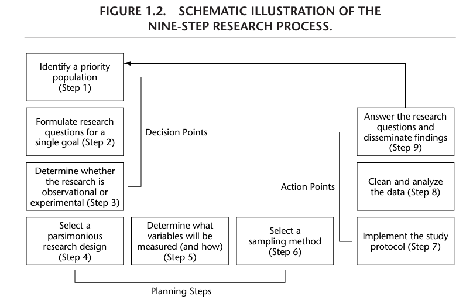
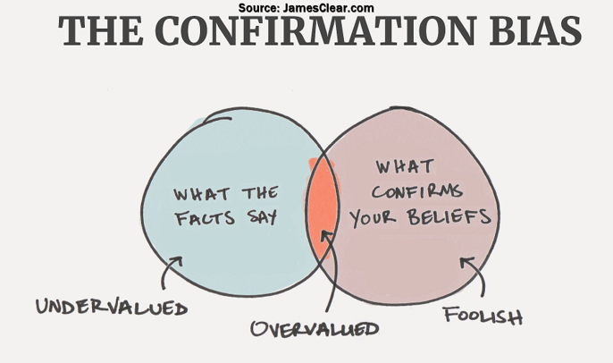
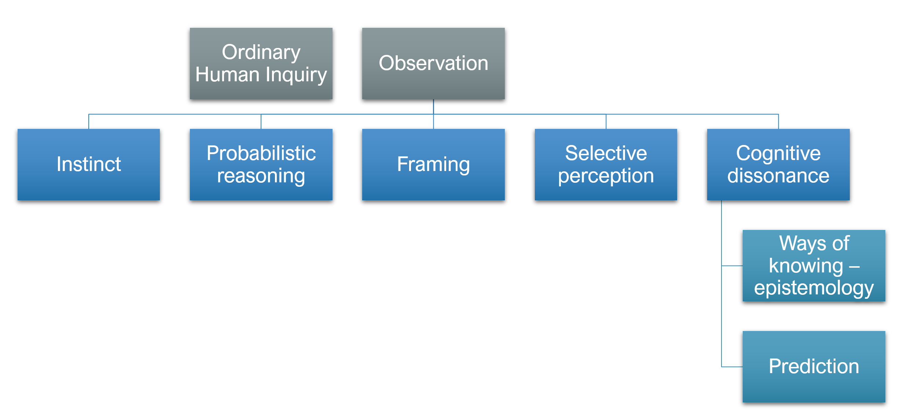

class: inverse, center, middle

# Introduction

---

# Course Information

Review course website
- Course structure
- Course requirements
  - Required reading
  - Required software
- Course assignments

---

# Course Dos and **Don'ts**

Here is a list of course Do's (as in please do) and Don'ts (as in **DO NOT**):

.pull-left[
1. Be respectful to others at all times;

1. Reach out for help;

1. Follow my suggestions for what you should be doing each week;

1. If you have a problem with something, tell me directly;

1. Be kind, have grace, be professional, be humble, be mature
]

.pull-right[

1. Come unprepared for class;

1. Do not express insensitivity to anyone on the basis of race, gender or class;
]

---

# Purpose of research

Four main purposes

--

- Exploratory
  - research conducted to examine a problem that is not clearly defined
  - aims to better understand the nature of a problem rather than provide a definitive answer to it
--

- Descriptive
  - expands knowledge of a research problem by describing it according to its characteristics and population
  - aims to examine how and what rather than *why*
--

- Explanatory
  - determines how variables interact for the purpose of identifying "cause and effect" relationships
  - aims to identify why
--

- [Evaluation](https://www.dotnews.com/2012/northeastern-study-links-youth-jobs-lower-violence)
  - a systematic analysis that measures the effectiveness of a strategy or program
  - aims to determine the merit of a strategy or program for a given set of outcomes

---

# Outlining Specific Aims (NIH)
- **Step 1**: Determine whether your research questions are exploratory (hypothesis-generating) or confirmatory (hypothesis-testing)

---

---
# Example from NIH R01

**A. SPECIFIC AIMS**

[[Intro]]

Despite this elevated risk, current National Action Alliance for Suicide Prevention’s research has not established mechanisms and protective factors uniquely associated with African American youth suicidal thoughts and behaviors, especially resilience needed to develop culturally tailored interventions to better serve them. 

This multiphase explanatory sequential mixed-methods study’s overarching goal is to conduct a pre-intervention investigation and translate the findings to guide and inform intervention selection and adaptation that will reduce suicide given BAAY’s developmental (internal and external) assets and their associations with STBs. 

---

# Example: Society of Family Planning

Given the spatial heterogeneity in abortion laws across the United States, and in light some states’ efforts to ensure access to abortion and other forms of reproductive healthcare, it is reasonable to expect increasing healthcare burden in some states compared to others. For example, travel demands will increase to states that facilitate access to abortion, and consequently there will be greater demands placed on pregnant persons in surrounding states due to inaccessibility of family planning providers, including abortion facilities. To better understand the fine-grained spatiotemporal patterns in access to reproductive healthcare across areas that are politically and economically disempowered, we address the following research questions: (1) Do women of reproductive age who live in socially vulnerable, and transportation disadvantaged areas have equal access to different types of family planning centers? and (2) How has spatial accessibility to family planning centers changed in the aftermath of Dobbs: To address these questions, we have the following research aims. 

**Aim 3:** Assess whether regional disparities in accessibility have been exacerbated across levels of neighborhood structural disadvantage including housing and transportation disadvantage, economic hardship and inequality, financial strength, and educational attainment in the post-Dobbs era. Hypothesis: We expect that regional disparities have increased in areas of high vulnerability compared to areas of low vulnerability post-Dobbs. 

---

# Understanding the Scientific Method
**Definition:** The scientific method is a systematic process through which researchers aim to construct accurate representations of the world

<blockquote> All models are wrong, but some are useful. .right[-- <cite>George Box</cite>]
</blockquote>
--
**Objective:** Minimizing personal and cultural biases in the perception and interpretation of natural phenomenon.

**Four steps:**
- Observation and description
- Formulating a hypothesis
- Prediction
- Hypothesis testing

**Role of hypothesis testing:** hypothesis testing confirms or disproves a hypothesis, theories are never proven. 

---

# Research Methodology
**Definition:** Research is a formal, systematic application of the scientific method to study some aspect of the social or physical world.

**The research process includes:**
- Problem selection and definition
- Data collection
- Data analysis
- Drawing conclusions

---

# Key Steps in the Research Process

**Step 1:** Problem selection and definition

- Problem clarification, situation analysis, model development, specification of information requirements

--

**Step 2:** Execution

- Selecting the sample, collecting data, specifying measurement (questionnaires, interviews, scale development)

--

**Step 3:** Data analysis

- Converting observations into descriptive statements and inferences

--

**Step 4:** Drawing and stating conclusions

- Logical inference and summary

---

# The Research Process Summary

<figure>
  
</figure> 

.footnote[[*] [@crosby_research_2006] ]
---

# Philosophy of Science and Theory Construction

## Epistemology

‘Ways of knowing’; not only how we know but also who can know

--

Positivism
- Objective, neutral and value free 
- Starting point: observation
- A systematic body of rules; and
- Valid because they are enacted by authority or derive logically from existing decisions

--

Not everything is scientific and not all knowledge is created equal

--

Standpoint
- People have different experiences and therefore know things from different perspectives
- Examples

---

# Methods of Knowing

Common methods of knowing:

1. Authority
1. Tradition
1. Conventional Wisdom
1. Common sense
1. Formal logic
1. Personal (lived) experience

---
# Reliance on authority can have grave consequences

“Let me tell you this, explain to you, I made the comment that black people are trafficking in our state. Now, ever since I said that comment, I’ve been collecting every single drug dealer who has been arrested in our state. I don’t ask them to come to Maine and sell their poison, but they come, and I will tell you that 90-plus percent of those pictures in my book, and it’s a three-ringed binder, are black and Hispanic people from Waterbury, Connecticut, the Bronx and Brooklyn.” - Gov LePage, 2016

--

<figure>
  
</figure> 

Professor Gia Barboza, of Northeastern’s School of Criminology and Criminal Justice, described the governor’s “90-plus percent” figure as “laughable” and “completely inaccurate.”

---

# Tradition
- What are some common health beliefs that remain firmly entrenched in our minds and culture and continue to influence health behaviors?

--

- The book refers to these as **old wives tales**

--

Why do these beliefs persist even though they are false?

--

Be careful. This lecture is about biases. *Who decides?*

---

# Logical and Reasoning

### The Gambler's Fallacy

Let $X$ be the event of tossing a fair coin. What is $P(X = H)$?:
--

- Probability of observing 1 head: $P(X=H)= {1 \over 2}$
--

- Probability of observing 2 heads in two tosses of a fair coin: $P(X=HH)= {1 \over 2}^2$
--

- Probability of observing 5 heads in five tosses... : $P(X=HHHHH)= {1 \over 2}^5$
--

- Probability of getting tails on the fifth toss after observing four heads: $P(X=T|HHHH)= {1 \over 2} \ne {1 \over 2}^5$

Note: my story at the airport

---

# Food for thought

What is the relationship between ignorance and knowledge?
What types of things affect how you view the world?

--

We use causal and probabilistic reasoning 
- This is often problematic

---

# Scientific Inquiry as Epistemology 

**Step 1:** Problem selection and definition

--

What can go wrong?

Social science is founded on rationality. Rationality is flawed.

--

Can Humans really do science objectively?

Thomas Kuhn: Structure of Scientific Revolutions
Paradigm
- Widely accepted explanations, or theories protected by those who benefit from its dominance

--

- Normal science--routine verification of a theory

--

- Scientists are prisoners of dominant paradigm

--

- Anomalies build up - cases that don't fit the theory

--
- Revolutionary science--abrupt development of new theory to help explain anomalies, resistance by status quo

---
# Unconscious bias

.pull-left[
- Intuition vs. Practice wisdom
- Cognitive biases
- Errors in logic

]

.pull-right[
<figure>
  
</figure>  ]

---
# Common Pitfalls: Subjectivity

<figure>
  
</figure> 

---

# Common Pitfalls: Observation

- Observation
  - "Scientists are prisoners of dominant paradigm"
  
---

# Common Pitfalls: Observation

Lack of evidence

Inability to prove something true 

--

The paradox of the Black raven: Are all ravens black?
<figure>
  
</figure>

---

# Hempel's Raven Paradox

Hypothesis: All ravens are Black

--

Assume that we only observe a Black raven. We take this as evidence that all ravens are black.

The idea that **"all ravens are Black"** can be stated as "*If* raven *then* Black" If $$R \rightarrow B$$

--

Following the rules of logic, then
If *not* Black, *not* raven If $$~B \rightarrow ~R$$

--

So, Hempel argued that if seeing a raven that is black is evidence that all ravens are black, then seeing a non-black thing that is not a raven is also evidence that all ravens are black.

If non-Black things are not Ravens, means that a green apple (a non-Black, non-raven) is evidence that all ravens are Black. The problem is we need to disprove that all ravens are Black by seeing a White raven.

---

# Questions

If we cannot prove anything, have we discovered the truth? 

What implicaitons for 'evidence-based practice?'

---
# Example

"The impact of domestic abuse on children and young people is well documented."

--

This is much different from saying:

- "Research has proven that children and adolescents of divorce are at risk for an assortment of adjustment problems. It is our job as a society to help children and adolescents cope with family disruptions such as parental divorce. Implementing more programs and preventive measures can help reduce a child or adolescent from partaking in deviant acts." 

- "Literature for this research has proven that children’s exposure to parental violence might mean that their chances of learning peaceful ways of living are shattered at the onset."

.footnote[[*] Robertson, H. (2016). Exploring potential connections between parental divorce, deviance and negative child outcomes: A literature review. Arkansas Tech University.

Coates, J. (2011). Physically fit or physically literate? How children with special educational needs understand physical education. European Physical Education Review, 17(2), 167-181.
]

---

# Observation: Cognitve Bias and Social Constructions

.pull-left[
What outcomes are likely for individuals with these characteristics according to extant research?
- High school dropout obtained a GED
- Record of legal involvement
- Was a parent as a teenager
- Carries a weapon for protection
- Is a self-proclaimed "rebel" who does not trust authority
- Minor offenses like public intoxication
- Police involvement for domestic violence
]

--

.pull-right[
<figure>
  
</figure> ]

---

# Cognitve Bias and Social Constructions
Social constructions and political power
- What is the role of science in maintaining social constructions?

What is race? What does it mean to be Black? Indigenous?
What is gender? What does it mean to be a man? a transgender man?

---

|                                                                                                                           |
|:------------|:-------------|:-----------------------------------------------|:-----------------------------------------------|
|             |              |  **Constructions**                             |                                                |
|             |              |  **Positive**                                  |  **Negative**                                  |
|  **Power**  | **Strong**  |  **Advantaged** 
 

 
 |  **Contenders** 
 

 
 |
|             | **Weak**     | **Dependents**  
 

 
 | **Deviants**  
 

 
   |  
---
# Unconscious bias

.pull-left[
- We often make ‘snap judgements’
- These are not necessarily based on our intuition
- These reflect unconscious bias
- what role of adaptive unconscious?
]

.pull-right[
<figure>
  
</figure> ]

---
# Implications

Science is as much a political process as it is a rational one.

--

- Van Howe, R. S. (2015). Circumcision as a primary HIV preventive: Extrapolating from the available data. Global Public Health, 10, 607–625.
- Morris, B. J., Barboza, G., Wamai, R. G., & Krieger, J. N. (2016). Circumcision is a primary preventive against HIV infection: Critique of a contrary meta-regression analysis by Van Howe.Global public health, 1-11.
- Van Howe, R.S. (2017) Expertise or Ideology? A Response to Morris et al. 2016, ‘Circumcision Is a Primary Preventive against HIV Infection: Critique of a Contrary Meta-Regression Analysis by Van Howe’. Global Public Health, 2017, 1-19.
- Morris, B. J., Barboza, G., Wamai, R. G., & Krieger, J. N. (2017). Expertise and Ideology in Statistical Evaluation of Circumcision for Protection against HIV Infection.World Journal of AIDS,7(03), 179.

---

# Other Common Pitfalls (Later)

- Causation
- Measurement
- Validity
- Reliability
- Sampling
- Analyses

---

They are best suited for studies that have individual people as the unit of analysis
They are often used for other units of analysis as well, such as households and organizations
Even in these cases, we need people as respondents
Many examples: BJS collects data on local detention facilities – jails are the UoA; The National Youth Gang Survey

---
# Unit of Analysis
The major “thing” being analyzed in your study
It is the “who” or “what”
Usually individuals, can also be groups or social organizations or other things

What is the unit of analysis for 
- Barboza-Salerno, G. E. (2020). [Variability and stability in child maltreatment risk across time and space and its association with neighborhood social & housing vulnerability in New Mexico: A bayesian space-time model.](https://www.sciencedirect.com/science/article/pii/S0145213420301277?casa_token=ooa5R4MswOUAAAAA:HdE66nKYJ0wFfW5caFu5X4mY7EufVEjuw2bVYTkgu8WDRdQB4Qk71F6etvkTkRsbJtPs_3Z7d3Sp) Child Abuse & Neglect, 104, 104472. https://doi.org/10.1016/j.chiabu.2020.104472  
- Yang, T.-C., Kim, S., Zhao, Y., & Choi, S. E. (2021). [Examining spatial inequality in COVID-19 positivity rates across New York City ZIP codes.](https://www.sciencedirect.com/science/article/pii/S1353829221000708?casa_token=sC5jpoput9sAAAAA:LIrijgDzfcje9BI60uBZOKoKyMrgs6ShPkDWE11M7iNm7vinDkq_GlTzPGZFCDfEZCQtFfPxqoLJ) Health & Place, 69, 102574. https://doi.org/10.1016/j.healthplace.2021.102574  
- Moss, J. L., Reiter, P. L., & Brewer, N. T. (2015). [Correlates of human papillomavirus (HPV) vaccine coverage: A state-level analysis.](https://www.ncbi.nlm.nih.gov/pmc/articles/PMC4295643/) Sexually Transmitted Diseases, 42(2), 71–75. https://doi.org/10.1097/OLQ.0000000000000225  
---

|                                                                                          |                  |
|:-----------------------------------------------------------------------------------------|:-----------------|
| Research Question                                                                                 | Unit of analysis |
| Do Republicans perceive crime in the US is a bigger problem than Democrats? |                  |
| What differences exist between Latino and Asian gangs?                                   |                  |
| Do bigger hospitals have more patient deaths?                                            |                  |
| Are crime rates in Columbus higher than Dayton?                        |                  |  
---

# Preliminaries_00

Think about a topic you might want to study this semester as part of a research project. 

Write down how individuals/institutions commit specific errors in logic or reasoning when discussing his specific topic?

-- 

Example

---

# Discussion Topics

1. Given the inherent urgency of some problems, should practice perhaps sometimes proceed without research?

1. How should a research team proceed if the findings run contrary to some objective?

1. Do non-significant findings have any importance for anyone besides the persons investigating the question in the same research chain?

---

# Let's Build Some Research Skills

- Demonstrate Zotero
- Run R scripts
