class: inverse, center, middle

# Proof in Research

---

# What Constitutes "Proof"?

"Proof" in research means reducing measurement error, or random noise, to limit or minimize the uncertainty surrounding our statistial inferences

--
Example: Our OLS estimates are called 'BLUE' because they are the *B*est *L*inear *U*nbiased *E*stimates of the relationship betwen $X$ and $Y$

--

Classic approach: if A does not cause B, how likely would we have been to observe the results we did? This is also known as the **counterfactual**

--

This is analogous to our coin flip

- The $H_0$: The coin is fair 
  - Question: how does this equate to the standard null of *no difference*?

- If we flip a coin $n$ times and get 7 heads, how likely would it be to get 7 or more heads with a fair coin?

- *Note*: this question has SUBSTANTIAL AND SIGNIFICANT social justice and policy implications

---
# Example

How can we assess whether jury selection is a random process (i.e., the null hypothesis) in this case?
<figure>
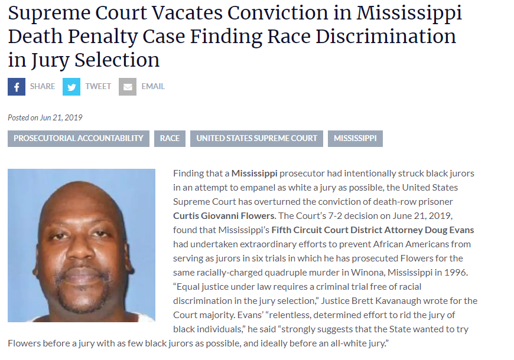
</figure> 

---
How many jurors would you expect if the null hypothesis that the jury is fair, is true?

--

Let $A$ = the number of jurors selected, then

$$ P(A) = \binom{N}{k} \cdot p^kq^{N-k}$$

<figure>
 
 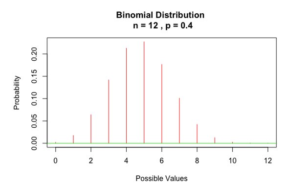

</figure>   
---
class: inverse, center, middle

# Quantifying Risk and Uncertainty

---

# Review: Categorical Measures of Association
Information on the effect of a potential risk factor or beneficial treatment can be presented in several different ways:
- Relative Risk (RR)
- Odds Ratio (OR)
- Percent decrease or increase in Odds

The way risk information is presented and interpreted can have a profound effect on decision-making processes with implications for policy and treatment outcomes

---
# Review: Categorical Measures of Association

Risk ratios (RR) and odds ratios (OR) are measures of association

Measures of association quantify the potential relationship between “exposure” and “outcome” among two groups.

Recall there are two types of association (+) and (-)

---
# Risk Ratios
$RR$ is the ratio of the prevalence of an outcome for the primary group of interest divided by the prevalence of an outcome in a comparison group, $RR = {P_p \over P_c}$

A $RR$ = 1.0 the risk is the same for both groups, if $RR$ > 1.0 the risk is greater for group in numerator and if $RR$ < 1.0 it indicates decreased risk for group in numerator.
---
# Risk Ratios (Example)
<figure>
 
 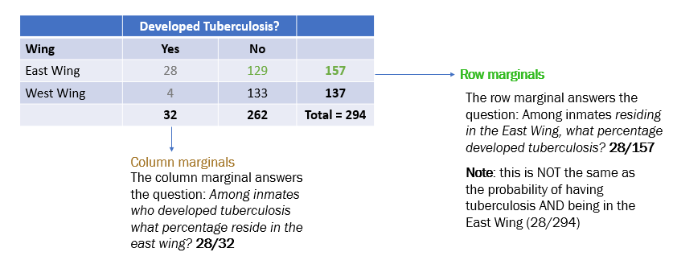

</figure>  
What is the risk ratio (RR) of developing tuberculosis among inmates in the east wing compared to the west wing?
- Step 1: What percentage of East Wing inmates developed tuberculosis? This is also the ‘risk’: 

--
  - 28/157 = 17.8%

---
# Risk Ratios (Example)
<figure>
 
 

</figure>  
What is the risk ratio (RR) of developing tuberculosis among inmates in the east wing compared to the west wing?

- Step 2: What percentage of West Wing inmates developed tuberculosis? This is also the ‘risk’: 

--
  - 4/137 = 2.9%
  
---
# Risk Ratios (Example)
<figure>
 
 

</figure>  
What is the risk ratio (RR) of developing tuberculosis among inmates in the east wing compared to the west wing?

- Step 3: Compute the $RR \rightarrow {17.8 \over 2.9} = 6.1$ 

--
- Step 4: (Harder): Interpret the $RR$

---
# Your Turn
Below is a table describing the number of persons who developed COVID-19 by vaccination status.

What is the relative risk of developing COVID-19 among individuals who have been vaccinated (compared to those who have not?

<figure>
 
 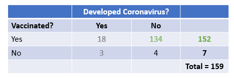

</figure>  

--

What percent of vaccinated persons developed corona?

What percent of unvaccinated persons developed corona?

Compute and interpret the relative risk…

--

The risk of developing COVID-19 among those who are vaccinated by the Pfizer vaccine is .28 times that of those who are not.

---
# Review Odds & Odds Ratios
Recall the odds of an event or outcome, $A$, is defined as

$$Odds(A) = \large {p_A \over {1-p}_A}$$

--

For example, suppose we roll a single (fair) die, compute the odds of rolling a 3:

Let $A$ be the event of rolling a "3", then:

$$P(A) = {1 \over 6}$$

$$1 - P(A) = {5 \over 6}$$

$$Odds(A) =  {\large p_A \over {1-p}_A} = { {\large 1\over 6} \over {\large 5\over 6}} \rightarrow {1:5}$$

--

Interpret: The odds of rolling "3" are 1 in 5

---
# Odds Ratio (Step 1: Conditional Probability)
<figure>
 
 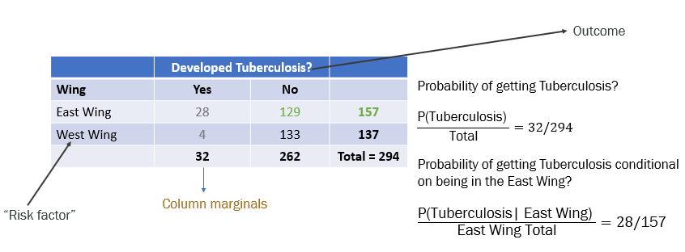

</figure>  

---
# The Odds Ratio
The Odds Ratio (OR) is ratio of the odds for the outcome for those with risk factor to the odds for the outcome for those without the risk factor

<figure>
 
 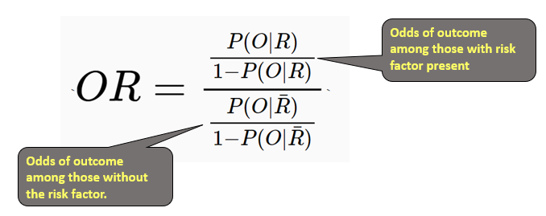

</figure>  

---
# Example
For the following data, compute the odds ratio of having a 1st preg. before (or at) age 25 (the outcome) among women who have cervical cancer (risk factor) and those who do not 

BE CAREFUL -- Cancer can be a risk factor *OR* an outcome. Here it is a risk factor.

<figure>
 
 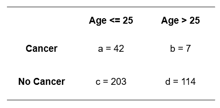

</figure>  

---
# Example

Step 1: What is the Pr(Age $\le$ 25|cancer)?

--
$${42 \over 49} = .857$$

Step 2: What is the Pr(Age $\le$ 25|not cancer)?

--
$${203  \over 317} = .640$$

What are the odds(Age $\le$ 25|cancer)?

--

$$5.99$$

What are the odds(Age $\le$ 25|no cancer)? 

--

$$1.78$$

--

What is the odds ratio for Age $\le$ 25 for women and other pregnant persons with cancer compared to Age $\le$ 25 for those without cancer?

$${5.99 \over 1.78} = 3.37$$
---
# Short cut formula

You are probably used to seeing the shortcut formula

The problem with shortcuts is that you do not understand how it was derived

Make sure you can compute the odds 'by hand'

The easy way is to use this formula

$$OR = {a \times d \over b \times c}$$
<figure>
 
 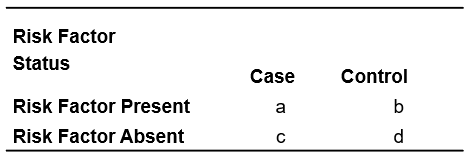

</figure> 

---
# Making Odds Interpretable
Compute the odds as a percent increase or decrease (this is often the better interpretation because people understand percentages better than they understand odds)

The percent change in the odds is defined as $$|{(OR−1) \times 100}|$$
*Example*: Odds ratio = 1.89 calculate the percent change in the odds
$$|(1 – 1.89)| \times 100 = 89\%$$ 
**Note:** the odds have *increased* why?

*Example*: the odds of a first pregnancy among women aged 25 or younger is [(3.4 - 1) * 100 =] 240% higher among women who had cervical cancer compared to those who have not.

---
class: inverse, center, middle

# Random v Systematic Error

---
# Bias & Measurement Error

Two major types of errors
- Non-differential or random
- Differential or systematic

--

Random error: use of invalid outcome measure that equally misclassifies cases and controls***

Systematic error: use of an invalid measure that misclassifies cases in one direction and controls in another
---

# Random Error v Bias

Chance is caused by random error
- Random error may or may not be able to be accounted for
  - If the random error is due to the sample size, increase the sample
- Random error affects the precision of your statistical estimates, i.e., makes them less precise

--

Bias is caused by systematic error 

Can not be fixed

Bias leads to inaccurate results

---

# Types of Bias
Systematic errors that may or may not be able to be addressed by your research design or analysis

--

Selection Bias 
- Unrepresentative nature of samples or/and the method of participant selection distorts the exposure-outcome relationship from reality

--

Information (Misclassification) Bias
- Collecting information differently between two groups leads to an error

--

Confounding 
- Some other factors (variables) distort  the exposure-outcome relation
- May lead to conclusion errors but if known can be addressed

---
class: inverse, center, middle

# Association & Confounding

---
# Proof, Association & Confounding
Once an association is found, you must ask whether it is real, OR:
- Is the association due to chance?
- Could the association be attributed to bias or measurement error?

---

# Association and Confounding

It is possible for two variables to be associated without having "causation"

There could be some other factor that is responsible for the apparent association

The other factor is called a confounder

Easy example: more babies are born in areas where storks are present

---
# Example

Confounding is of particular concern in observational studies

Grodstein et. al, 1996 conducted a study that found a lower rate of heart disease in postmenopausal persons taking hormone replacement therapy, an intuitive finding to many researchers

The data seems to suggest that the risk of heart disease is much lower for those taking hormone replacement

<figure>
 
 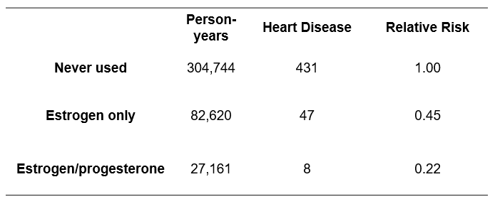

</figure> 

---
# Confounding, Proof, and Bias
Many doctors believed that the study proved that hormone replacement lowered risk of heart disease

--

Many others did not, and worried about the possibility of confounding...

--

Years after the original study was published, the NIH funded a large randomized clinical trial to examine the association
 
- Women were asked to have their treatment decided by a coin flip: hormonal therapy or placebo
- When treatments are randomized, any confounding factors are equally distributed across treatment groups, and hence are less likely to impact conclusions drawn (but [see](https://phhbhp7534.netlify.app/example/bias))

[aside: start thinking about the ethics of such a study]

---
# Redeaux

A study of over 68,000 women followed for about 6 years determined that women who received the hormone therapy were more likely to have heart disease compared to those receiving the placebo.

This clearly contradicts the findings from the earlier, observational study

What factors may explain the differences across studies?***

---
# Confounding
Confounding occurs when the relationship between a given exposure and a specific disease/outcome is distorted (confused) by the influence of a third variable or group of variables (confounders)

By controlling for confounding, we can obtain an unbiased estimate of the causal relationship between exposure and outcome

--

Two ways to deal with confounding

- The study design phase (by randomization, restriction and matching) (later)

--

- During data analysis (by **stratification** and multivariate analysis (later))

---
# Stratification
A statistical technique that allows to control for confounding by creating two or more categories (strata) in which the confounding variable either does not vary or does not vary very much

Two types of adjustments for confounding by stratification: 
- Pooling analysis by the Mantel-Haenszel formula; and 
- Standardization

---
# Preliminary (Stratification)
- The simplest way to control confounding during data analysis
- Preliminary step towards applying the Mantel-Haenszel formula and standardization

**Running example:** A relationship between Down syndrome and maternal age is found. 

But, is birth order *causally* associated with Down syndrome independently of the *confounding effect* of the maternal age?

---
# Stratification for Confounding: The Mantel-Haenszel Formula

1) Does the frequency of Down Syndrome (O = outcome) increase with birth order (E = exposure)?

<figure>
  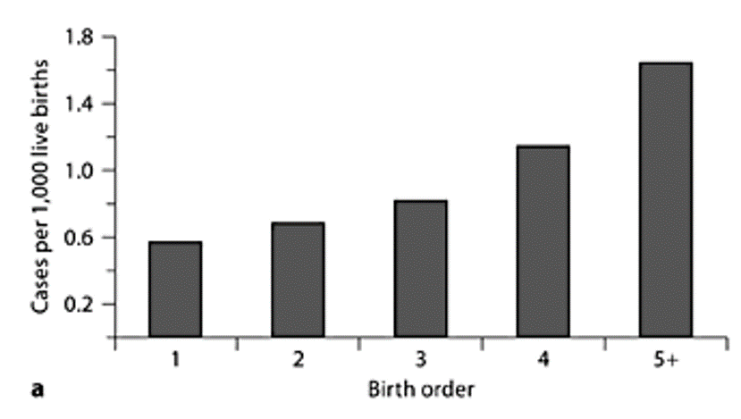
</figure> 

From this figure, it appears that as birth order increases, so to does the number of down syndrome cases per 1,000 live births.

--

**Note carefully:** it is NEVER possible to assess statistical significance by eyeballing data. This is because both the number of cases in your analysis and the standard error are both factors in the statistical test.
---
# Stratification for Confounding: The Mantel-Haenszel Formula
2) Is maternal age (C) associated with Down Syndrome (O)?

<figure>
  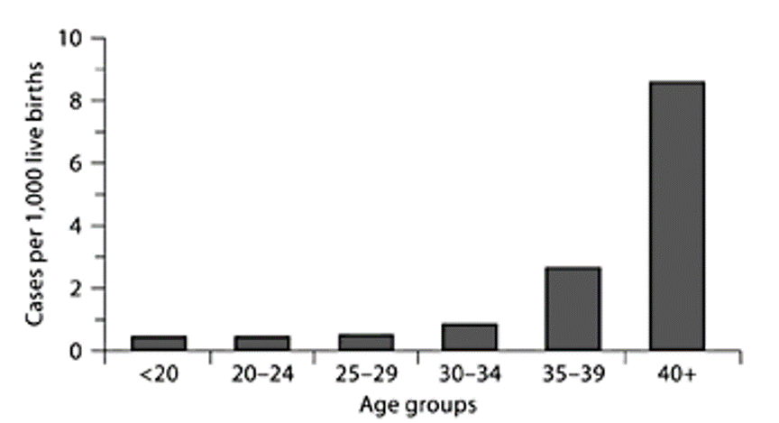
</figure> 

Again, it appears that older women and pregnant persons are at higher risk of having a child with down syndrome.

These differences appear drastic
---

# Stratification for Confounding: The Mantel-Haenszel Formula

Does the frequency of Down syndrome increase according to maternal age for each category of birth order? 

<figure>
  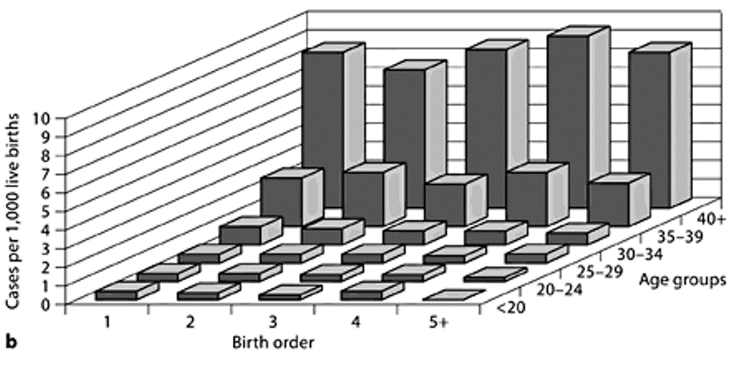
</figure> 

Yes. But in each age category the birth order did not affect the frequency of Down syndrome. 

Thus, the crude association between birth order and Down syndrome is the mere result of the confounding effect of maternal age.

[@tripepi_stratification_2010]
---

# Confounding

<figure>
  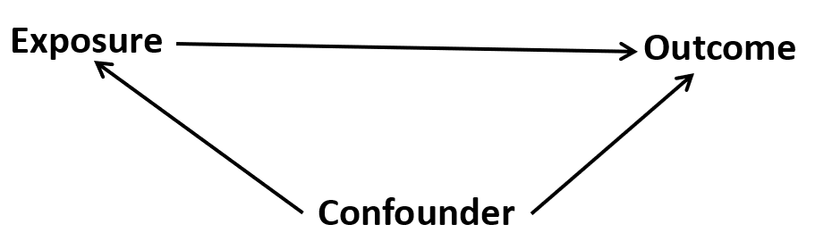
</figure> 

To be a confounding factor, two conditions must be met:

- The confounding variable must be associated with the exposure (but not a consequence of the exposure)

The confounding variable must be associated with outcome

  - Independently of exposure

The confounding variable cannot be an intermediary step in the causal pathway from the exposure of interest to the outcome of interest.

---
# Apply the rules to the running example

<figure>
  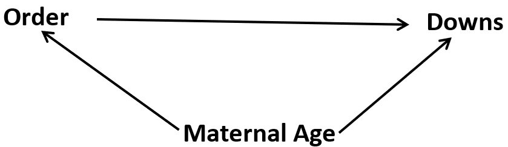
</figure> 

1. The confounding variable must be associated with the exposure (but not a consequence of the exposure)

- In the running example, maternal age is associated with birth order

2. The confounding variable must be associated with outcome independently of exposure

  - In the running example, maternal age is associated with Down Syndrome cases per 1,000 live births
  
3. The confounding variable cannot be an intermediary step in the causal pathway from the exposure of interest to the outcome of interest.

--

Summary: maternal age is correlated with birth order and a risk factor even if birth order is low. So maternal age is confounder.

**Note:** There was no chart of the relationship between birth order and maternal age, there need not be. It should be obvious that as maternal age increases do does birth order.

---
# Test Your Understanding

Is birth order a confounder in the association between maternal age and Down Syndrome? *Why/Why not*?

--

<figure>
  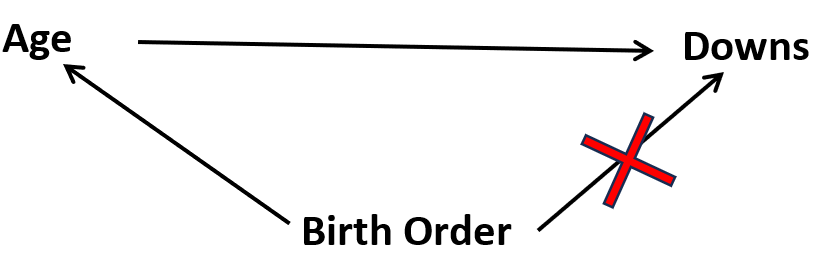
</figure> 

1. The confounding variable must be associated with the exposure (but not a consequence of the exposure)

- In the running example, is birth order associated with maternal age?

2. The confounding variable must be associated with outcome independently of exposure

  - In the running example, is birth order associated with Down Syndrome cases per 1,000 live births *independent* of maternal age?
  
3. Is birth order an **intermediary step** in the causal pathway from the maternal age to Down Syndrome?
---

# Control of Confounding in the Analysis - Stratified
[See example](https://phhbhp7534.netlify.app/example/confounding_stratification.html)

[See example](https://phhbhp7534.netlify.app/example/confounding)

[See example](https://phhbhp7534.netlify.app/example/infant_mortality)
---

# Summary
Comparing the crude and stratum-specific measures of association is a very practical way to determine whether confounding is present and how bad it is

You calculate an overall crude (unadjusted) relative risk (or odds ratio) and compare it to the stratum-specific relative risks (or odds ratios). 

If the stratum-specific measures of association are similar to the crude measure of association, then there is no confounding by that factor, and you can just use the crude measure of association. 

However, if the stratified estimates of association differ from the unadjusted estimate by 10% or more, then there is evidence of confounding.

---
# Note
Stratified analysis works best when there are few strata (only 1 or 2 confounders have to be controlled)

If the number of potential confounders is large, multivariate analysis are applied

Can handle large number of confounders  (covariates) simultaneously 

Based statistical regression models

