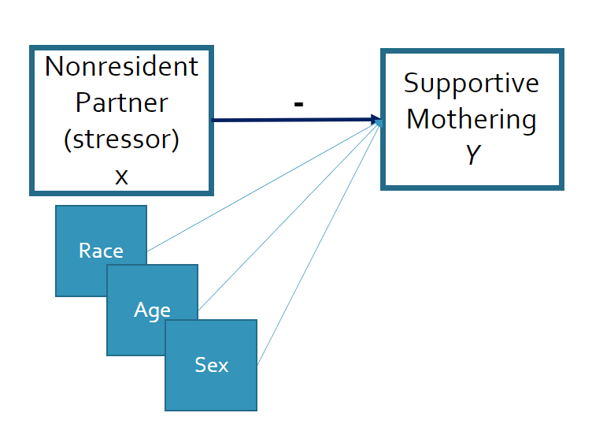
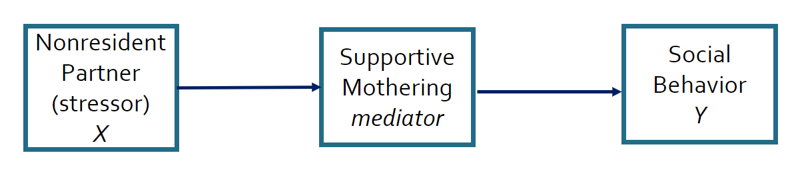

class: inverse, center, middle

# Introduction

Mediation, Moderation and Conditional Process Modeling
---

# Bias

The regression equations you learned in Biostats or Statistics examine whether independent variables have a “direct” effect on a dependent variable. 

--

.pull-left[
<figure>
  
</figure>
]

--

.pull-right[
Direct effects are common in social science research, but “indirect” effects are also common. ]

---

# What is Mediation?
Mediation is present when the effects of an independent variable on a dependent variable occur fully or partially through its effects on another variable.

The terms “indirect effects” and “mediation” are used interchangeably. 

To remember what mediation is, think about how mediators are people who work between two people to resolve a dispute. 

In statistics, mediators come between two variables.

---

# Simple Example

- Parenting by mother with no partner is associated with preschooler’s lower school readiness. 
- The relationship is explained by the effects on mothers of the stress of a nonresident parenting partner. 
- The stress is hypothesized to lead to less supportive parenting, which in turns affects children’s social behavior. 

--

<figure>
  
</figure>

---

# How we used to test for mediation

1. Regress the DV on the IV and evaluate the IV’s coefficient

- Social Behavior on Nonresident Partner

1. Regress the mediator on the IV and evaluate coefficient.

- Supportive Mothering on Nonresident Partner

1. Regress the DV on both the IV and the mediator.

- Social Behavior on Nonresident Partner and Supportive Mothering

1. Examine the magnitude and significance of the coefficients for both the IV and mediator.

1.  Test the significance of the two-part indirect path using the Sobel test.
