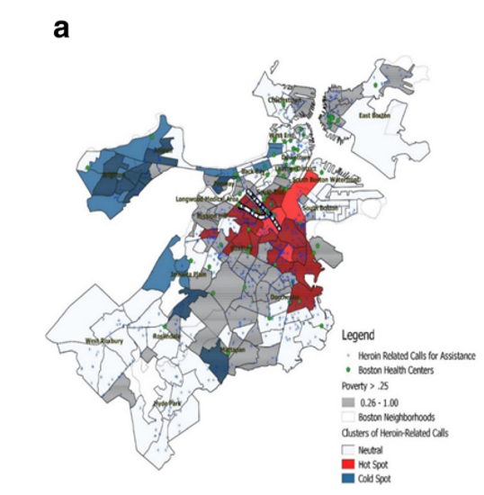
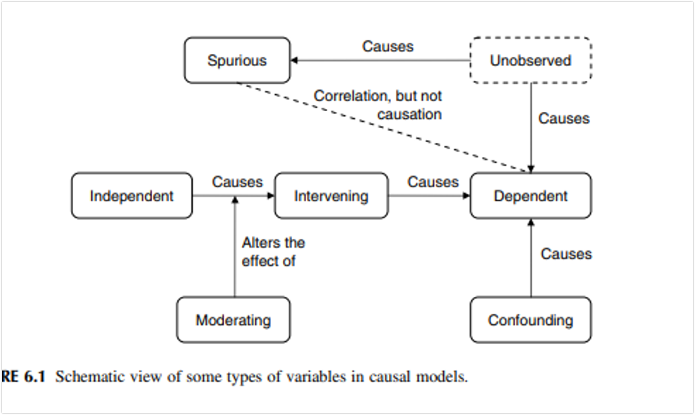
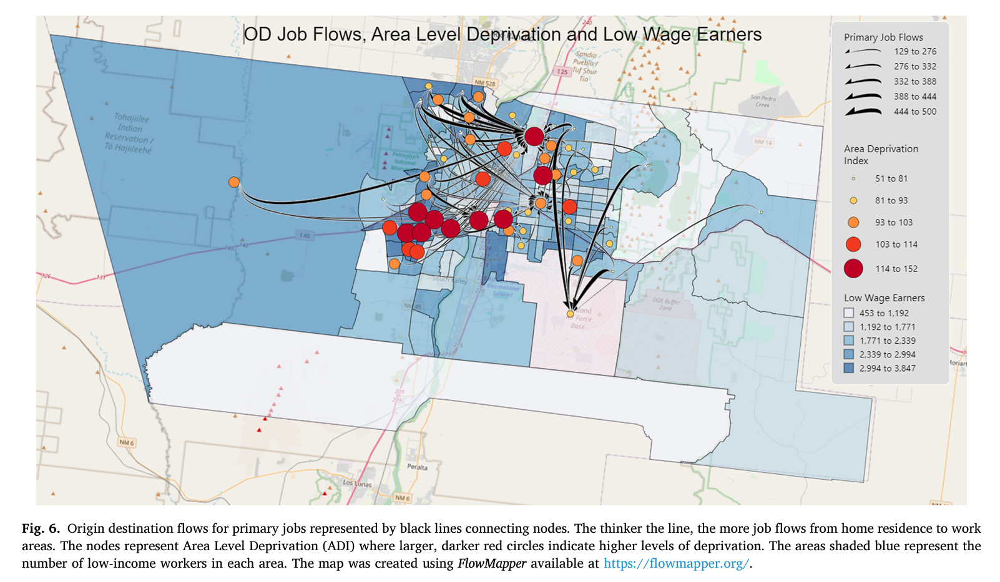

class: inverse, center, middle

# A note on measurement

---

Many issues involve a comparison between two proportions (or probabilities). 

- How would you describe the disparity in pass (or fail) rates (and what are the problems of interpretation)?
  
  - The difference in pass (fail) rates
  - The ratio of the pass (fail) rates
  - The odds ratio 
  
---
# Example

Consider the example of a test taken by males and females on which males are observed to have a higher pass rate. Assume that the passage rate for males is 97% and the passage rate for females is 90%

- What is the difference in pass rates?
- What is the difference in fail rates?

---
# Ratio of pass/fail rates

If the passage rate for males is 97% and the passage rate for females is 90%.

What is the ratio of the pass rates? interpretation?

--

${\huge .97 \over \huge .90} = \Large 1.07$

--

What is the ratio of the fail rates? interpretation?

--

${\huge .10 \over \huge .03} = \Large 3.33$

---

# Odds of passing

What are the odds of passing for males and females?

The odds of passing for males

$Odds = {p_M \over 1-p_M} = {.97 \over 1-.97} = {.97 \over .03} = 32.3:1$

--

The odds of passing for females

$Odds = {p_W \over 1-p_W} = {.90 \over 1-.90} = {.90 \over .10} = 9:1$

--

- for every 9 females that pass, 1 will not pass 
- for every female that fails, 9 will not fail

---

# Odds of failing  
The odds ratio of the fail rates is defined as the odds of failing for females divided by the odds of failing for males.

Divide the two odds calculated above of failing for females (1 in 9) and males (3 in 97)

$OR = {{1 \over 9} \over {3 \over 97}} = {{97 \over 27} }= 3.6$

# Odds of passing
The odds ratio of the pass rates is defined as the odds of passing for females divided by the odds of passing failing for males.

Divide the two odds calculated above of passing for females and males

$OR = {{9 \over 1} \over {97 \over 3}} = {{27 \over 97} }= .278$

--

The OR is invariant
---

class: inverse, center, middle

# Research Questions & Hypotheses

---

Researchers seek to explain the causes of some phenomenon (e.g., IPV)

How do we plan scientific inquiry?

Mostly we are interested in cause and effect

Causation in the focus of explanatory research

Cause in social sciences is inherengly probablistic (focus on likelihoods)

- Children exposed to domestic violence are more likely to develop internalizing syndromes

Two primary modes of explanation
- Ideographic
- Nomothetic

---
# Criteria for establishing causality

Idiographic posited by Maxwell (2005)

- How credible and believable it is; and
- Whether rival hypotheses have been seriously considered, and ruled out

Nomothetic posited by Shadish, Cook, & Campbell (2002)

- Any relationship that satisfies the following criteria is causal
---
# Establishing causality

4 Criteria

- **Covariation**: Empirical (i.e., statistical) relationship between variables; if A changes, B must also change. 
  - This is necessary, but not sufficient, i.e., not enough alone to show cause
--

- **Temporal order**: (cause precedes effect) (most often timing is unclear): IV comes before DV

--

- **Non-spuriousness**: No alternative explanations—no spurious other variable(s) affecting the initial relationship

--

- **Theoretical lens**: Theory that explains the relationships

--

Does poverty cause crime?

---
# Poverty Causes Crime

**Empirical relationship:** two variables must covary or in other words there must be some *statistically significant* correlation between them 

– But, how big must the correlation be? 

**Temporal order:** Which comes first poverty or crime? 

**Spurious relationship:** What are some possible confounders?

---

## Example

.pull-left[
- I was interested in the most efficient places to have safe injection facilities

]

.pull-right[
<figure>
 
 

</figure>  
]

Barboza, G. (2018). A Spatiotemporal Analysis of Heroin-Related Calls for Emergency Medical Services and Community-Health Centers in Boston, Massachusetts. Applied Spatial Analysis and Policy 13:507–525.
---

## Example

.pull-left[
- How proximate are CHCs in relation to calls for assistance for a heroin-related overdose?

]

.pull-right[
<figure>
 
 

</figure>  
]

Barboza, G. (2018). A Spatiotemporal Analysis of Heroin-Related Calls for Emergency Medical Services and Community-Health Centers in Boston, Massachusetts. Applied Spatial Analysis and Policy 13:507–525.
---

## Example

.pull-left[

- Do CHCs encourage drug markets? What alternative explanations? What policy recommendations?

]

.pull-right[
<figure>
 
 

</figure>  
]

Barboza, G. (2018). A Spatiotemporal Analysis of Heroin-Related Calls for Emergency Medical Services and Community-Health Centers in Boston, Massachusetts. Applied Spatial Analysis and Policy 13:507–525.
---

# Necessary v. Sufficient Causes
“Discovering one cause that is both necessary and sufficient is the most satisfying outcome of explanatory research.”

--

Within the probabilistic model, two types of causes:

A statement is a **sufficient condition** for another statement if the truth of the first would guarantee the truth of the second. Represents a condition that, if it is present, guarantees that the effect will occur

--

A statement is a **necessary condition** for a second if the truth of the second statment is necessary for the truth of the first statment. Represents a condition that must be present for the effect to occur

--

To get your MPH at OSU, all university-related fees must be paid.  i.e., to get your degree, you must pay your fees. *Necessary or Sufficient*

--

If you plead guilty for murder, you will go to jail. *Necessary or Sufficient*

---
# Example

Several times we have discussed the relation between ACEs and some health outcome. Describe the conditions for each of the following that would lead us to conclude that ACEs are a:

- A sufficient cause
- A necessary cause
- A necessary and sufficient cause

Now change the example to examine the relation between poverty and crime

- A sufficient cause
- A necessary cause
- A necessary and sufficient cause

---

# Example

Becker, K., El-Faddagh, M., Schmidt, M. H., & Laucht, M. (2007). Is the serotonin transporter polymorphism (5-HTTLPR) associated with harm avoidance and internalising problems in childhood and adolescence?. Journal of Neural Transmission, 114, 395-402.

The S allele of the 5-HTTLPR has been associated with anxiety-related behavioural traits and harm avoidance. The 5-HTTLPR polymorphism is suggested to modulate the serotonergic response to stress, **meaning that individuals carrying the SS genotype who have significant stress histories may tend to develop depressive symptoms.** 

--

In the Mannheim Study of Risk Children, which followed a cohort of n = 384 from birth to adolescence, the association of 5-HTTLPR with harm avoidance and internalising problems was examined, including gender and early life stress as possible moderators. Child and adolescent characteristics were assessed using the Junior Temperament and Character Inventory, the Child Behaviour Checklist and the Youth Self Report. Early life stress was determined by a risk index measuring the presence of 11 adversity factors. Results did not reveal an association with 5-HTTLPR genotype. There were no moderating effects of early life stress or gender. 

--

One explanation for the negative findings is that the S allele is a *Necessary/Sufficient* cause.

---

# More Causality Confusion

You MUST think through the different possible explanations for your results.

**Equifinality**: one outcome can have many causes

--

Individuals with substance use disorder come from "good" homes.

--

**Multifinality**: different outcomes can result from one common factor

--

Adults who experienced early child trauma graduate from college and refrain from committing crime.

---

<figure>
 
 

</figure>  

---

class: inverse, center, middle

# Research Questions

---
# Research Questions
Research entails asking very specific questions and testing very specific hypotheses 

Broad questions are usually broken into smaller, testable hypotheses or questions

Resarch questions are also called objective and/or aims 

- The RQ helps focus the hypothesis to provide evidence in favor or against, not prove, the RQ

---
# Part I: What is an interesting RQ?

Ask yourself: "How can I make what I do or know now, no matter how adequate it seems, look outdated or old fashioned as soon as possible?"

--

Live outside the box
<figure>
 
 

</figure>  

Zaltman G. Breaking out of the box: meaning and means. Adv Consum Res. 1997; 24123-9

---

# Social "Disorganization" Theory

Decades of research has established the importance of acknowledging the broader ecological and community systems (Drake & Pandey, 1996) that are directly or indirectly associated with child maltreatment substantiations, particularly in impoverished neighborhoods. Operating within this framework, research has identified a broad array of ecological factors that strain the interpersonal relations between children and caregivers (Molnar et al., 2016). However, economic hardship, defined by income poverty, is the most widely cited ecological factor associated with substantiated child maltreatment (Thomas & Waldfogel, 2022) and social disorganization theory has become its primary organizing framework (Garbarino and Sherman, 1980, Thomas and Waldfogel, 2022, Zuravin, 1989). According to social disorganization theory, social and economic “disorder” results in low levels of collective efficacy and community cohesion which hinders the ability of community members to “know and care about each other, work together, and remember past outcomes from efforts to influence other community problems” (Mustaine et al., 2014, p. 174).

Barboza-Salerno, G. E. (2024). Material Hardship, Labor Market Characteristics and Substantiated Child Maltreatment: A Bayesian Spatiotemporal Analysis. Children and Youth Services Review, 157, 107371.
---

# Unemployment versus Labor Market

Past research has demonstrated a link between certain labor market characteristics and substantiated child maltreatment risk including caregiver unemployment (Dery & Arapis, 2022), job loss (Schenck-Fontaine et al., 2017) and employment instability (Cai, 2021). However, even though the labor market is broader and more complex than employment alone, it has been narrowly conceptualized, and, has received little to no attention outside of the employment context. In practice, the unemployment rate is a function of several neighborhood factors that reduce the likelihood that an individual will be able to secure and/or keep a job. As a result, neighborhoods with “plentiful and diverse job opportunities” may confer a number of micro- and macro- level advantages such as shorter commuting times, job proximity and accessibility, and access to prosocial networks (Coulton, 2003, Hillier, 2007). Broadly speaking, neighborhood features tend to explain the spatial distribution of labor market factors such as: the 1) characteristics of the area where workers live (e.g., race/ethnicity, mode of transportation, educational attainment, gender); 2) characteristics of the job (low-income job sector, distance from worker’s residence); and 3) characteristics of the area where workers are employed (Martín-Barroso et al., 2022).
---

# Reframing the literature: Material Hardship and Labor Market Characteristics

<figure>
 
 

</figure>  

---

# Part 2: Thinking of an interesting research topic

.pull-left[
**Standard Practice**
- Problems experienced in practice?
- Poor outcomes?
- Resource issues?
- Why is it done that way?
- Explain trends or anomalies?
- Outside issues impacting the field?
- New or revised standards/guidelines?

]

.pull-right[
**Add your passion**
- What angers, frustrates or makes me uncomfortable about the way research is moving forward in this area?
- How is the current research reinforcing the status quo?
- Are current ideologies, theoretical orientations, measurements harming communities based on race, class, disability, gender, veteran status (long list)?
- What/why has this research topic been overlooked?

]

---

# Part II: The Research Purpose/Question
## Not all interesting topics make good research questions

Read the literature and answer these questions:

- Why does this work need to be done?
- Does the work pertain to a significant problem in your field?
- What gaps have you identified in the extant research?
- What other work can help you design *this* study? What about work in other fields?
- What theoretical models have been used to view this problem?
- What gaps in your own knowledge are barriers to getting this work completed?

---

# Your turn

What are some interesting and important research topics that are important to your community?

---

.pull-left[
**Elements of "Good" RQs**
- Have no simple answer but are answerable using data (a range of existing sources are available)
- Open the door for more research (encourages debate/dialogue)
- Begin with "how" "what" "why" or "which"
- Pass the "so what" test (interesting and significant)
- Are problem oriented
- Are analytical rather than descriptive
- Are feasible
- Are clear, focused, concise

]

.pull-right[
**Elements of Not good RQs**
- Have simple answers or cannot be answered
- Are too broad, contain too many factors
- Is value laden, leading
- Can be answered with opinion
- Begin with "who" "when" "where" "how much" "how many"
- Are not interesting, important and/or policy relevant
- Has been asked and answered
]

--

**Note**: it is up to you to explain why this is a good research question

---
# Examples

.pull-left[
- How does participating in sports benefit youth?

]

--

.pull-right[
 - How does participation in the Columbus Recreation and Park Arts Academy improve educational outcomes (grades, connection, engagement) for youth aged 5 - 15?

]

---

# Examples

.pull-left[
- Why does violence exposure result in the development of post-traumatic stress?
]

--

.pull-right[
- Under what conditions do unsheltered persons who have experienced intimate partner violence develop symptoms of post-traumatic stress?
]

---
# Examples

.pull-left[
- Which type of therapy reduces symptoms of depression?
]

--

.pull-right[
- Does cognitive-behavioral therapy reduce PTSD symptoms among veterans in active combat in the war in Afghanistan?
]
